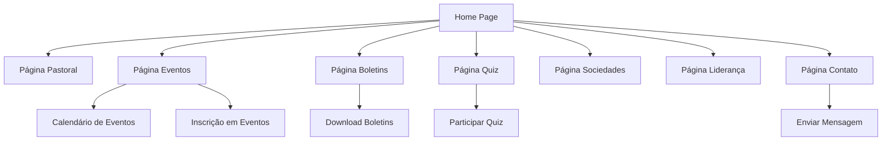

## 1. Product Overview
Transformação do site da empresa Ideal Embalagens em um site institucional completo para a Igreja Presbiteriana do Brasil - Sede Governador (IPBSG), mantendo a estrutura e design original do site.

O projeto visa criar um portal institucional moderno para a igreja, permitindo divulgação de conteúdo religioso, gestão de eventos, publicação de boletins e interação com a comunidade religiosa local.

## 2. Core Features

### 2.1 User Roles
| Role | Registration Method | Core Permissions |
|------|---------------------|------------------|
| Visitante | Sem registro | Navegar por todo conteúdo público, visualizar eventos, boletins e informações |
| Membro | Cadastro via formulário | Acesso a conteúdo exclusivo, participação em quiz, recebimento de notificações |
| Administrador | Cadastro interno | Gerenciar todo conteúdo, publicar boletins, criar eventos, moderar quiz |

### 2.2 Feature Module
O site da IPBSG consiste nas seguintes páginas principais:
1. **Home page**: apresentação da igreja, destaques de eventos, versículo do dia, navegação principal.
2. **Página Pastoral**: perfis dos pastores, pregações recentes, calendário pastoral.
3. **Página Quiz**: perguntas bíblicas, ranking de participantes, histórico de quiz.
4. **Página Boletins**: lista de boletins mensais, download em PDF, arquivo histórico.
5. **Página Sociedades**: informações sobre sociedades internas, horários de reuniões, líderes.
6. **Página Liderança**: estrutura organizacional, conselho, diáconos e presbíteros.
7. **Página Eventos**: calendário de eventos, inscrições, galeria de fotos de eventos passados.
8. **Página Contato**: informações de contato, formulário de contato, localização no mapa.

### 2.3 Page Details
| Page Name | Module Name | Feature description |
|-----------|-------------|---------------------|
| Home page | Hero section | Apresentar imagem da igreja com versículo bíblico destacado, navegação intuitiva para todas as seções. |
| Home page | Eventos em destaque | Exibir próximos eventos com data, horário e breve descrição. |
| Home page | Versículo do dia | Mostrar versículo bíblico diário com referência. |
| Página Pastoral | Perfil dos Pastores | Apresentar fotos, biografia breve e mensagens dos pastores. |
| Página Pastoral | Pregações Recentes | Listar últimas pregações com link para áudio/vídeo quando disponível. |
| Página Quiz | Perguntas Bíblicas | Sistema de quiz com perguntas múltipla escolha sobre a Bíblia. |
| Página Quiz | Ranking | Mostrar classificação dos participantes com pontuação. |
| Página Boletins | Lista de Boletins | Exibir boletins mensais com capa, título e data de publicação. |
| Página Boletins | Download PDF | Permitir download direto dos boletins em formato PDF. |
| Página Sociedades | Sociedades Internas | Apresentar informações sobre EBD, Sociedade de Senhoras, Juventude, etc. |
| Página Sociedades | Horários e Líderes | Mostrar dias e horários de reuniões com nomes dos líderes responsáveis. |
| Página Liderança | Estrutura Organizacional | Apresentar conselho pastoral, presbíteros e diáconos com fotos. |
| Página Eventos | Calendário | Exibir calendário mensal com todos os eventos da igreja. |
| Página Eventos | Inscrições | Permitir inscrição online para eventos específicos. |
| Página Contato | Informações de Contato | Mostrar telefone, email, endereço e horário de funcionamento. |
| Página Contato | Formulário de Contato | Permitir envio de mensagens diretamente pelo site. |

## 3. Core Process
**Fluxo do Visitante**: O usuário acessa a home page → navega pelas seções do site (Pastoral, Eventos, Boletins) → visualiza informações → participa do quiz (se cadastrar) → entra em contato via formulário.

**Fluxo do Administrador**: Login no painel administrativo → gerencia conteúdo das páginas → publica novos boletins → cria/edita eventos → modera quiz → atualiza informações de contato.

## 4. User Interface Design

### 4.1 Design Style
- **Cores Primárias**: Azul royal (#4169E1) e branco (#FFFFFF)
- **Cores Secundárias**: Dourado (#FFD700) para detalhes e acentos
- **Estilo de Botões**: Arredondados com hover effect suave
- **Fontes**: Sans-serif moderna (Roboto/Open Sans) para legibilidade
- **Layout**: Baseado em cards com navegação superior fixa
- **Ícones**: Estilo minimalista com símbolos cristãos sutis

### 4.2 Page Design Overview
| Page Name | Module Name | UI Elements |
|-----------|-------------|-------------|
| Home page | Hero section | Imagem da igreja em full-width com overlay de texto bíblico, botão "Conheça Mais" destacado. |
| Home page | Navegação | Menu fixo no topo com logo da IPBSG, links para todas as seções, design responsivo. |
| Página Pastoral | Grid de Pastores | Cards horizontais com foto circular, nome e mini-bio, hover revela link para pregações. |
| Página Quiz | Interface de Quiz | Cards de perguntas com opções em botões coloridos, barra de progresso, pontuação animada. |
| Página Boletins | Galeria de Boletins | Grid responsivo com miniaturas dos boletins, modal para visualização antes do download. |
| Página Eventos | Calendário Interativo | Calendário mensal visual com eventos coloridos, click para detalhes e inscrição. |

### 4.3 Responsiveness
O site será desenvolvido com abordagem desktop-first, totalmente responsivo para tablets e smartphones. Navegação adaptável com menu hambúrguer em dispositivos móveis, otimização de imagens e toques para interações em telas touch.