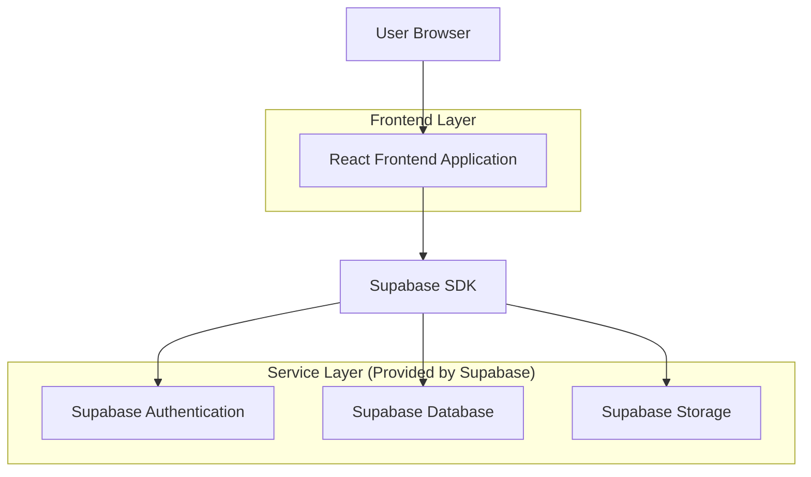
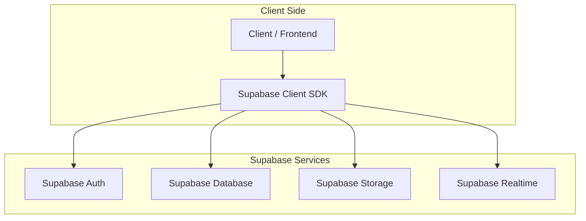
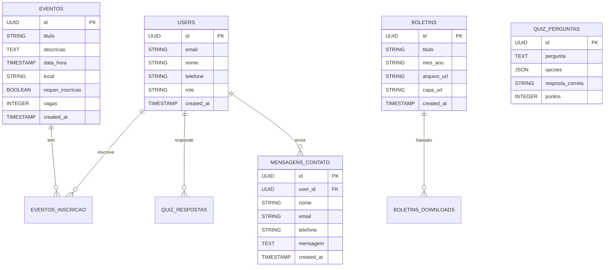

## 1. Architecture design



## 2. Technology Description
- Frontend: React@18 + tailwindcss@3 + vite
- Initialization Tool: vite-init
- Backend: Supabase (BaaS)
- Database: PostgreSQL (via Supabase)
- Storage: Supabase Storage para boletins PDFs e imagens
- Authentication: Supabase Auth

## 3. Route definitions
| Route | Purpose |
|-------|---------|
| / | Home page, apresentação principal da igreja |
| /pastoral | Página da pastoral com perfis dos pastores |
| /quiz | Quiz bíblico interativo |
| /boletins | Lista e download de boletins mensais |
| /sociedades | Informações sobre sociedades internas |
| /lideranca | Estrutura de liderança da igreja |
| /eventos | Calendário e informações de eventos |
| /contato | Formulário e informações de contato |
| /admin/* | Painel administrativo (protegido) |
| /auth/* | Rotas de autenticação (login/registro) |

## 4. API definitions

### 4.1 Core API

**Gestão de Boletins**
```
GET /api/boletins
POST /api/boletins
DELETE /api/boletins/:id
```

Request (POST):
| Param Name| Param Type  | isRequired  | Description |
|-----------|-------------|-------------|-------------|
| titulo    | string      | true        | Título do boletim |
| mes_ano   | string      | true        | Mês e ano (formato MM/YYYY) |
| arquivo_url | string    | true        | URL do arquivo PDF no Supabase Storage |
| capa_url  | string      | false       | URL da imagem de capa |

**Gestão de Eventos**
```
GET /api/eventos
POST /api/eventos
PUT /api/eventos/:id
DELETE /api/eventos/:id
```

Request (POST):
| Param Name| Param Type  | isRequired  | Description |
|-----------|-------------|-------------|-------------|
| titulo    | string      | true        | Título do evento |
| descricao | text        | true        | Descrição completa |
| data_hora | timestamp   | true        | Data e horário do evento |
| local     | string      | true        | Local do evento |
| requer_inscricao | boolean | false  | Se requer inscrição |

**Sistema de Quiz**
```
GET /api/quiz/perguntas
POST /api/quiz/responder
GET /api/quiz/ranking
```

Request (POST responder):
| Param Name| Param Type  | isRequired  | Description |
|-----------|-------------|-------------|-------------|
| pergunta_id | UUID      | true        | ID da pergunta |
| resposta  | string      | true        | Resposta do usuário |
| usuario_id | UUID       | true        | ID do usuário |

## 5. Server architecture diagram



## 6. Data model

### 6.1 Data model definition



### 6.2 Data Definition Language

**Tabela de Usuários (users)**
```sql
-- create table
CREATE TABLE users (
    id UUID PRIMARY KEY DEFAULT gen_random_uuid(),
    email VARCHAR(255) UNIQUE NOT NULL,
    nome VARCHAR(100) NOT NULL,
    telefone VARCHAR(20),
    role VARCHAR(20) DEFAULT 'membro' CHECK (role IN ('visitante', 'membro', 'admin')),
    created_at TIMESTAMP WITH TIME ZONE DEFAULT NOW()
);

-- create index
CREATE INDEX idx_users_email ON users(email);
CREATE INDEX idx_users_role ON users(role);
```

**Tabela de Eventos (eventos)**
```sql
-- create table
CREATE TABLE eventos (
    id UUID PRIMARY KEY DEFAULT gen_random_uuid(),
    titulo VARCHAR(200) NOT NULL,
    descricao TEXT NOT NULL,
    data_hora TIMESTAMP WITH TIME ZONE NOT NULL,
    local VARCHAR(200) NOT NULL,
    requer_inscricao BOOLEAN DEFAULT false,
    vagas INTEGER DEFAULT 0,
    created_at TIMESTAMP WITH TIME ZONE DEFAULT NOW()
);

-- create index
CREATE INDEX idx_eventos_data ON eventos(data_hora);
```

**Tabela de Boletins (boletins)**
```sql
-- create table
CREATE TABLE boletins (
    id UUID PRIMARY KEY DEFAULT gen_random_uuid(),
    titulo VARCHAR(200) NOT NULL,
    mes_ano VARCHAR(7) NOT NULL,
    arquivo_url VARCHAR(500) NOT NULL,
    capa_url VARCHAR(500),
    created_at TIMESTAMP WITH TIME ZONE DEFAULT NOW()
);

-- create index
CREATE INDEX idx_boletins_mes_ano ON boletins(mes_ano);
```

**Permissões Supabase**
```sql
-- Permissões básicas para visitantes
GRANT SELECT ON eventos TO anon;
GRANT SELECT ON boletins TO anon;
GRANT SELECT ON quiz_perguntas TO anon;

-- Permissões completas para usuários autenticados
GRANT ALL PRIVILEGES ON eventos TO authenticated;
GRANT ALL PRIVILEGES ON boletins TO authenticated;
GRANT ALL PRIVILEGES ON quiz_respostas TO authenticated;
GRANT ALL PRIVILEGES ON mensagens_contato TO authenticated;
```